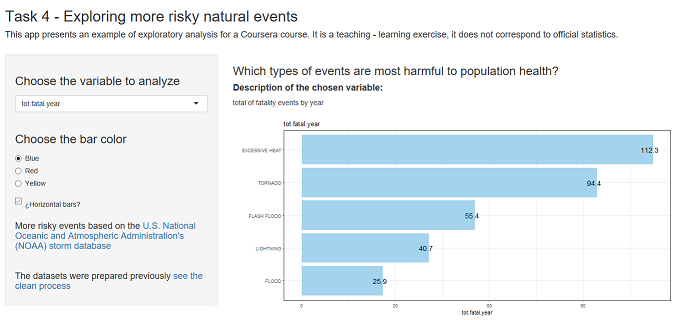

```{r setup, include=FALSE}
knitr::opts_chunk$set(echo = FALSE)
```

## 1. INTRODUCTION

This document presents an example of exploratory analysis for a Coursera course. 
It is a teaching - learning exercise, it does not correspond to official statistics.

Four main variables have been chosen: fatalities, injuries, damage to property (economic) and damage to (economic) crops. These have been studied from the total events per year_event (sum), as well as the average per event (variables created in this exercise, from the original data).

Exploratory evidence is provided for one question based on the most harmful types of events for the population and the events that cause the greatest economic consequences.


## 2. PROCEDURE

- Preparing data: The original data has observations from 1955 to 2011 (years); however, this analysis only used observations from 1996 to 2011 (higher quality and complete data set). The data were obtain from U.S. [National Oceanic and Atmospheric Administration's (NOAA) storm database](https://d396qusza40orc.cloudfront.net/repdata%2Fdata%2FStormData.csv.bz2). These consist of 902297 observations and 38 variables. However, the dataset was cleaned and aggregated. ([See the data preparation)](http://rpubs.com/jiprave/project2_exploring-data)

- Analizing data: "Which types of events are most harmful to population health?" (Results using bar plot). The user can modify severa options (variable for analiysis, color of bars and horizontal or vertical bars).

- Visualizing data using shiny app and prepating the support documentation

## 3. UI - only main components of shinyUI(fluidPage)
Note: the dataset is reading on the global.R
```{r sidebarpanel, echo = TRUE, eval=FALSE}
sidebarPanel(

selectInput("my.variab",label = h3("Choose the variable to analyze"), 
choices = names(Z[,-c(1:3)]),selected = "tot.fatal.year"),

radioButtons("colorin",label = h3("Choose the bar color"),
choices = list("Blue" = "lightskyblue2","Red" = "indianred1",
"Yellow" = "gold1"),selected = "lightskyblue2"),

checkboxInput("horiz", label = h5("¿Horizontal bars?"),value = TRUE),
mainPanel(

h3("Which types of events are most harmful to population health?"),
plotOutput("bars")    
))

```

## 4. SERVER - only main components of shinyServer
[See the complete code for the app on GitHub](https://github.com/jiprave/task4DP_coursera)
```{r server, echo=TRUE, eval=FALSE}
shinyServer(function(input, output) {
#Reactive function
    graficar<-reactive({
my.variab=input$my.variab
Zp<-data.frame(Z[order(Z[my.variab], decreasing = T),][1:5,])
g<-ggplot(Zp, aes(x = reorder(Zp$event, Zp[,my.variab]), 
y = Zp[,my.variab], fill = NULL, label=Zp[,my.variab]));g})
#Bar plot
    output$bars <- renderPlot({
g<<-graficar(); my.variab<<-input$my.variab
horiz<<-input$horiz;colorin<<-input$colorin
my.plot.top(g,my.variab,horiz,colorin)
        })
```

## 5. The web app


In the Figure, the 5 most harmful events for the health of the population are presented (using a variable based on the count by event-year). The user can choose another variable, change the color and position of the bars. [See Shiny App](https://idinnov.shinyapps.io/tas4_dp/)

.